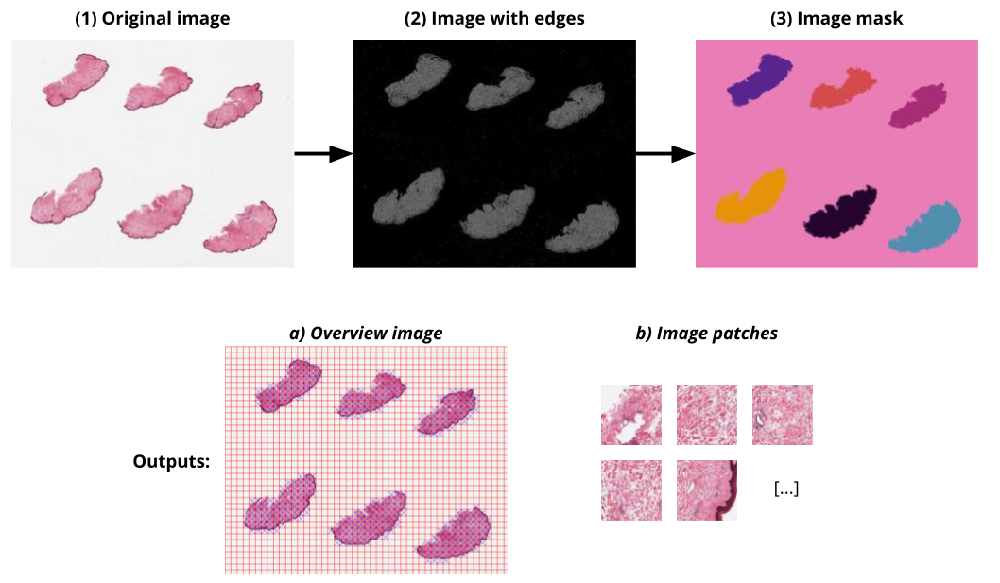
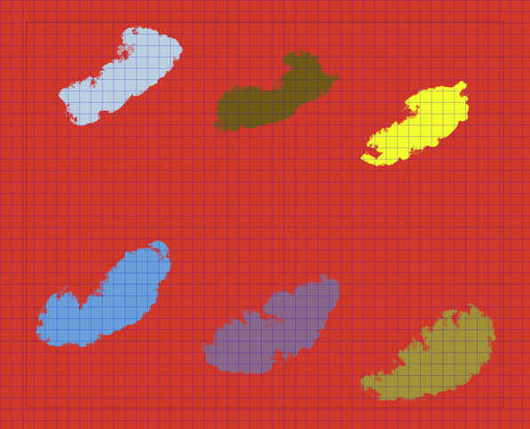
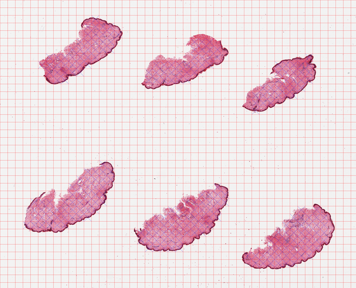
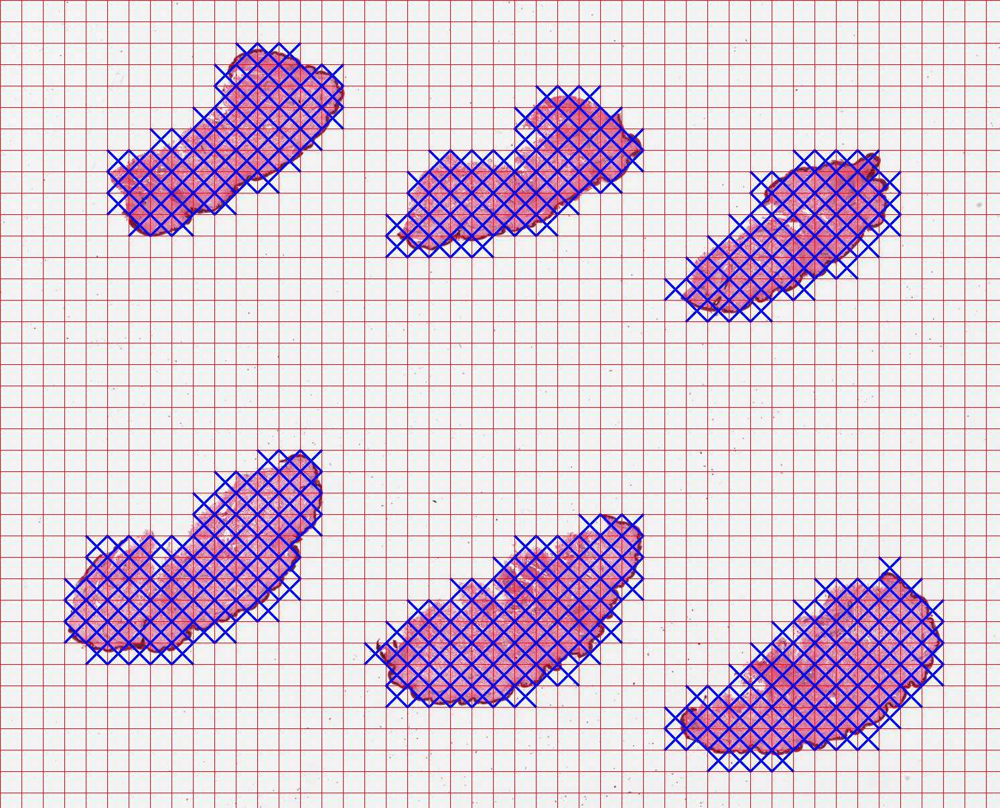
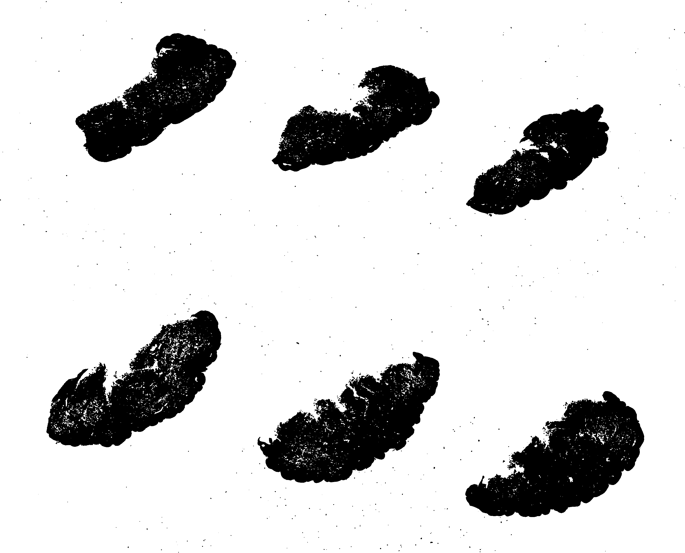

# How does PyHIST work?
PyHIST works with SVS files (see the [experimental support](#experimental_support) section for other file types). The PyHIST pipeline involves three main steps: 

1. Produce a mask for the input WSI that differentiates the tissue from the background, 
2. Create a grid of tiles on top of the mask, evaluate each tile to see if it meets the minimum content threshold to be considered as foreground 
3. Extract the selected tiles from the input WSI at the requested resolution. 

By default, PyHIST uses a graph-based segmentation method to produce the mask. From the input slide (a), an alternative version of the image (b) is generated using a Canny edge detector, which captures tissue details and enhances the distinction between the background and the foreground. Then, a [graph segmentation](http://people.cs.uchicago.edu/~pff/papers/seg-ijcv.pdf) algorithm is executed over it in order to generate a mask of the image regions with tissue content, i.e. differentiating the background (contiguous color region) from the foreground (different colors) (c). The mask is divided into a tile grid with a user-specified tile size. These tiles are then assessed to see if they meet a minimum foreground (tissue) threshold with respect to the total area of the tile, in which case they are kept (e), and otherwise are discarded. Optionally, the user can also decide to save all the tiles in the image. An overview image (d) is generated during the tiling process in order to show which tiles were selected. 



With PyHIST, the output tiles can be generated from a downsampled version of the WSI, at factors that are powers of 2: depending on the application, it may be sufficient to work with a lower resolution version of the original WSI. Downsampling can also be applied independently at different stages of the process: if the mask is downsampled, the segmentation process is faster since it will be executed at a lower resolution. The segmentation overview image (panel (d) on the figure above) can also be downsampled: since it is used as a sanity check of the segmentation process, it is usually not necessary to keep a large version.


# Creating tiles from an histological image
You can run this tutorial in Google Colab:

[](https://colab.research.google.com/drive/17O8bhzDb9Wa594zBl5C5ubEnjQvbdknn?usp=sharing)

We will use an image of skin tissue from the [GTEx Histological Images resource](https://brd.nci.nih.gov/brd/image-search/search_specimen/). Download the sample with: 

	curl 'https://brd.nci.nih.gov/brd/imagedownload/GTEX-1117F-0126' --output 'GTEX-1117F-0126.svs'

If you have `ImageMagick` installed, the image properties can be viewed with the `identify` command. Level 0 contains the highest resolution for the image, while levels 2 and 3 are downsamples of 4x and 16x respectively. PyHIST will perform downsampling (if requested) by automatically choosing the most appropriate image level.
	
	identify GTEX-1117F-0126.svs

	> GTEX-1117F-0126.svs[0] TIFF 47807x38653 47807x38653+0+0 8-bit sRGB 328.3MB 0.000u 0:00.000
	> GTEX-1117F-0126.svs[1] TIFF 949x768 949x768+0+0 8-bit sRGB 328.3MB 0.000u 0:00.000
	> GTEX-1117F-0126.svs[2] TIFF 11951x9663 11951x9663+0+0 8-bit sRGB 328.3MB 0.000u 0:00.000
	> GTEX-1117F-0126.svs[3] TIFF 2987x2415 2987x2415+0+0 8-bit sRGB 328.3MB 0.000u 0:00.000
	> GTEX-1117F-0126.svs[4] TIFF 1600x629 1600x629+0+0 8-bit sRGB 328.3MB 0.000u 0:00.000

Let's assume that we want to extract tiles of size 64x64 (`--patch-size 64`) at a resolution downsampled by a factor of 16x. Several methods are available to perform segmentation within PyHIST (see the [Parameters](parameters.md) section). By default, PyHIST will use graph-based segmentation (`--method "graph"`) to decide which tiles are composed of foreground. For graph-based segmentation, a test mode is available (`--method "graphtestmode"`) to help verify how the image mask would look like, as well as how the image tiles look at requested resolution (`--test-downsample 16`). PyHIST uses these masks to threshold the foreground content. Graph test mode is useful to examine how the output would look like before proceeding to save all the tiles to disk. If the `--info "verbose"` flag is used, PyHIST will output detailed information during the execution.

By default, output will be saved in a folder with the same name as the input image:
```shell
python pyhist.py --method "graphtestmode" --patch-size 64 --test-downsample 16 --info "verbose" GTEX-1117F-0126.svs
	
# Display the image using any image viewer
eog output/GTEX-1117F-0126/test_GTEX-1117F-0126.png
```



The faint black border that is not part of the blue grid is an aid for the graph-based segmentation and is explained in the [Parameters](parameters.md) section in the documentation. Note that **by default, PyHIST will not save the tiles to disk**. This is done in order to avoid generating a large number of files by mistake. Once we verify the tiling and masking looks correct, we proceed to extract the tiles using the `--save-patches` flag at the requested resolution for the output (`--output-downsample 16`).

To save an overview image of the tiles that were selected, add the `--save-tilecrossed-image` flag.

	python pyhist.py --patch-size 64 --output-downsample 16 --save-patches --save-tilecrossed-image --info "verbose" GTEX-1117F-0126.svs

The generated overview image `output/GTEX-1117F-0126/tilecrossed_GTEX-1117F-0126.png` is below. The blue crosses mark the tiles that are selected as containing tissue content.


A log file `tile_selection.tsv` is also generated in the output folder with metadata for each file, such as the dimensions, an indicator column `Keep` which contains 1 if the tile met the threshold for being considered as foreground, and 0 otherwise. Grid tile coordinates are encoded in the last two columns, with zero-based indexing.
```shell
head -n 5 output/GTEX-1117F-0126/tile_selection.tsv

Tile                    Width   Height  Keep    Row     Column
GTEX-1117F-0126_0000    64      64      0       0       0
GTEX-1117F-0126_0001    64      64      0       0       1
GTEX-1117F-0126_0002    64      64      0       0       2
GTEX-1117F-0126_0003    64      64      0       0       3
```

Depending on the application, we may want to be more (or less) strict on the amount of tissue we want to keep. To control this, we can use the `--content-threshold` flag, which is the minimal amount of tissue required (bounded to [0, 1] where 0 is no tissue content, and 1 is completely filled with tissue). The content threshold is calculated based on the mask generated by the selected method. To keep the edges of the tissue fragments in this sample skin image, we can set this flag as:

```shell
# Remove the output from the previous section
rm -rf output/

# Run PyHIST
python pyhist.py --patch-size 64 --content-threshold 0.05 --output-downsample 16 --save-patches --save-tilecrossed-image --info "verbose" GTEX-1117F-0126.svs
```

We examine the output of using this stricter --content-threshold:


The output format for the tiles (either `.png` or `.jpg`) can be specified with the `--format` flag.

# Otsu thresholding<a name="otsu"></a>
Tile generation can be also performed through thresholding methods (currently otsu and adaptive methods are available). These methods are simpler since in PyHIST they do not require to set additional segmentation parameters, and will work well for slides composed of homogeneous tissue segments. Graph segmentation is still preferred for complex cases where it may be difficult to generate a mask (for example, slides of adipose tissue with fat content that could be mistaken as background).

Here, we show an example of using Otsu thresholding. If we want to generate a smaller version of the tilecrossed image, we can use the `--tilecross-downsample` flag. Note that this is independent from the output resolution (i.e. we can examine the tile-crossed output at a lower resolution while still maintaining a higher resolution for the output). We can also save the generated mask using the `--save-mask` flag.

```shell
# Remove the output from the previous section
rm -rf output/

# Run PyHIST
python pyhist.py --method "otsu" --patch-size 64 --content-threshold 0.05 --output-downsample 16 \
 --tilecross-downsample 32 --save-patches --save-mask --save-tilecrossed-image --info "verbose" GTEX-1117F-0126.svs
```



Examine the mask:



# Random patch sampling<a name="randomsapling"></a>
It is also possible to randomly sample a given number of tiles (`--method="randomsampling"`) of a given size from the WSI at any downscaling factor. Note that **random sampling does not perform foreground thresholding**: it simply selects tiles at random from any position in the slide. For example, to extract 200 tiles at random from the native WSI resolution (`--output-downsample 1`):

```shell
python pyhist.py --method="randomsampling" --npatches 200 --output-downsample 1 --save-patches GTEX-1117F-0126.svs
```

# Experimental file support<a name="experimental_support"></a>
PyHIST was developed with Aperio SVS/TIFF files in mind. However, we currently also provide experimental support for the following formats:

* Hamamatsu (.ndpi, .vms)
* Trestle (.tif)